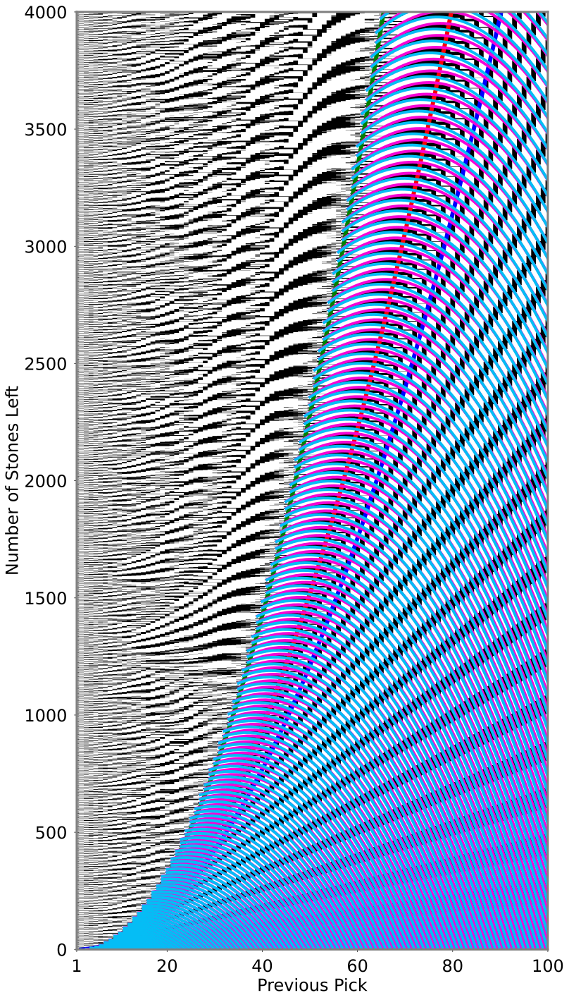

# Nim Visualizations

## To begin:
1. In your terminal run `git clone https://github.com/icowen/nim.git`
2. Run `cd nim`
3. Run `pip install -r requirements.txt`

## To create plots:
1. Run `python create_plots.py`. This will:
    1. Generate a csv in the `data/` directory used to make the plot. It is a representation of winning
    positions (indicated by a 1) and losing positions (0), and
    2. Create a plot in the `imgs/` directory.

## Plot Options
The output plot can be customized with the following command line arguments.
- `-xl X_MIN`, `--x_min X_MIN`  : Minimum  *x* value displayed on output. This must be greater than or equal to 1. Defaults to 1.
- `-xh X_MAX`, `--x_max X_MAX`  : Maximum *x* value displayed on output. This must be greater than x_min. Defaults to 100.
- `-yl Y_MIN`, `--y_min Y_MIN`  : Minimum *y* value displayed on output. This must be greater than or equal to 0. Defaults to 0.
- `-yh Y_MAX`, `--y_max Y_MAX`  : Maximum *y* value displayed on output. This must be greater than or equal to y_min. Defaults to 2000.
- `--img-file IMG_FILE`         : Output file name.
- -`-data-file DATA_FILE`       : Data file used for input. This can be helpful to avoid having to regenerate data.
- `--figsize FIGSIZE`           : Dimensions for output figure in inches. Must be 2 values separated by a comma. Defaults to (16, 16).   
- `--dpi DPI`                   : Dots per inch of output figure. High quality figures should be saved as `filename.svg` with a dpi of 1200. Defaults to 100.   
- `-i`, `--show-i-curves`           : Flag to indicate if the "i" curves should be plotted on the output.
- `-u`, `--show-upper-lower-curves` : Flag to indicate if the "upper" and "lower" curves should be plotted on the output.

## Example
    python create_plots.py -xl 1 -xh 100 -yl 0 -yh 4000 --img-file example-output.png --data-file example-data.csv --figsize 16,32 -i -u

This creates the following plot in `example-output.png` as well as the file `example-data.csv`.

